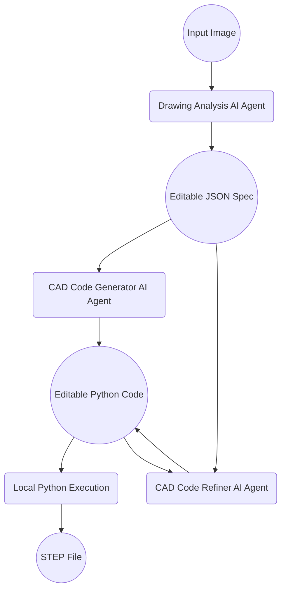

# cad3dify

Using GPT-5 (or Claude 4.5 opus, Gemini 3 pro, Llama 3.2 on Vertex AI), generate a staged 3D CAD workflow from a 2D CAD image.

## Getting started

Installation.

```bash
git clone git@github.com:neka-nat/cad3dify.git
cd cad3dify
poetry install
```

Run the command line workflow. Each stage writes its artifacts to disk so you can inspect and edit them before continuing.

```bash
export OPENAI_API_KEY=<YOUR API KEY>
python scripts/cli.py start sample_data/g1-3.jpg --workspace_dir runs/case1 --output_filepath output.step
```

Continue after manually editing the saved JSON or Python files.

```bash
python scripts/cli.py continue --workspace_dir runs/case1
python scripts/cli.py run-step refine-code --workspace_dir runs/case1
python scripts/cli.py run-step execute-code --workspace_dir runs/case1
```

Main workflow artifacts:

```text
workflow.json
input.<ext>
analysis.generated.json
analysis.generated.parts/
analysis.json
analysis.parts/
model_v01.generated.py
model_v01.py
execution_v01.log
output_v01.step
refine_feedback.txt
```

The first AI interaction converts the image into analysis.generated.json. After review, analysis.json becomes the editable source of truth. Later AI iterations compare and refine against the JSON specification, not against a rendered STEP image.
If the drawing analysis is too large for a single JSON document, the workflow also stores split documents under analysis.parts/ and analysis.generated.parts/. The later generation and refinement stages read those JSON documents sequentially and combine their constraints before producing CAD code.

Custom model endpoint (OpenAI-compatible API).

```bash
export CUSTOM_OPENAI_BASE_URL="https://your-model-endpoint.example.com/v1"
export CUSTOM_OPENAI_API_KEY="<YOUR_API_KEY>"
export CUSTOM_OPENAI_MODEL="your-model-name"
export CUSTOM_OPENAI_MAX_TOKENS="4096"
python scripts/cli.py start sample_data/g1-3.jpg --workspace_dir runs/case1 --model_type custom
```

Inspect a STEP or STP file and summarize its geometric envelope, face/edge types, and orthographic view composition.

```bash
python scripts/inspect_step.py sample_data/test.stp
python scripts/inspect_step.py sample_data/test.stp --compare_to sample_data/test2.stp
python scripts/inspect_step.py sample_data/test.stp --export_views_dir runs/test_views --output runs/test_views/summary.json
```

The inspector returns JSON with:

- overall bounding-box size and volume
- face and edge type counts
- circular-edge statistics grouped by projection plane
- top/front/right orthographic summaries
- optional diffs against a reference STEP file

## Architecture



## Demo

We will use the sample file [here](http://cad.wp.xdomain.jp/).

### Input image


### Generated 3D CAD model


